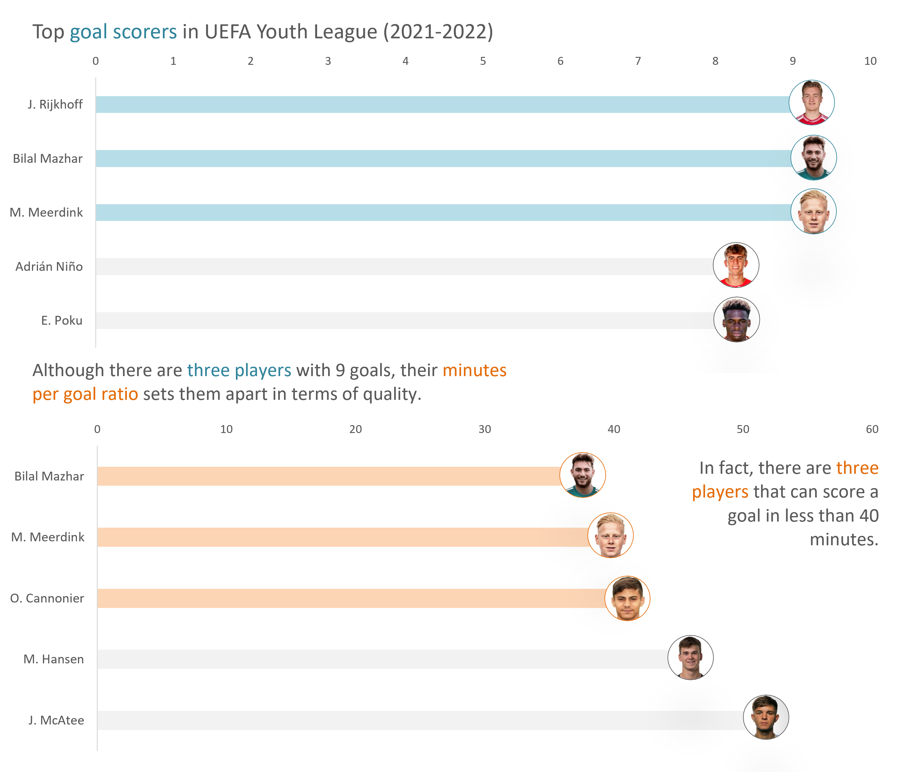

# 📊 **UEFA Youth League Best Strikers Data Analysis**

This project focuses on collecting and analyzing data from the **UEFA Youth League** using the [API-Football](https://www.api-football.com/) service. The main objective is to explore and evaluate the performance of young strikers, particularly focusing on top scorers. The data is processed and saved in CSV files for further analysis.

## 🔍 **Project Overview**

### 📂 **Data Collection**
- **API Source:** API-Football
- **Data Points:**
  - **Fixtures:** Matches played in each season.
  - **Top Scorers:** Players with the most goals in each season.

### 🔧 **Functionality**
1. **Fetch Available Leagues:** Retrieves the list of leagues available in the API to confirm access to the UEFA Youth League data.
2. **Data Extraction:**
   - Retrieves and stores data for fixtures, top scorers, assists, and cards for the selected seasons.
   - Seasons analyzed: **2020-2021**.
3. **Data Storage:** Data is saved in separate CSV files:
   - `📁 youth_league_fixtures_2020_2021.csv`
   - `📁 youth_league_top_scorers_2020_2021.csv`
   - `📁 youth_league_top_assists_2020_2021.csv`
   - `📁 youth_league_top_cards_2020_2021.csv`
4. **Data Analysis:** Due to limited data availability on assists and cards, the focus will be primarily on analyzing top goal scorers.

### 📈 **Key Insights**
- Provides an overview of the top-performing players in the UEFA Youth League based on goals scored.
- Analyzes player efficiency using metrics such as goals per minute played.

## 🚀 **How to Use**
1. **Setup:** Replace the `API_KEY` in the script with your own API key from API-Football. You can also use a different `COMPETITION_ID` to get data for a different leauge.
2. **Run the Script:** Execute the script to fetch and store data for each of the defined endpoints and seasons.
3. **View and Analyze Data:** The saved CSV files can be used for further analysis in tools like Excel, Power BI, or Python.

## 📋 **Requirements**
- `requests` for API requests
- `pandas` for data manipulation
- `tqdm` for displaying progress bars (not required)

## ✅ **Results**
The project successfully fetches and processes data for the UEFA Youth League. Due to the lack of comprehensive data on assists and cards, the focus will remain on goal-scoring statistics for a thorough evaluation of player performance.

### 🎯 Key Insights:
1. **Top Goal Scorers:**
   - The chart shows that **J. Rijkhoff**, **Bilal Mazhar**, and **M. Meerdink** lead with **9 goals each**.
   - **Adrián Niño** and **E. Poku** also performed well, but with fewer goals - 8.

2. **Scoring Efficiency:**
   - Despite having the same total goals, **Bilal Mazhar** has a significantly better efficiency, scoring a goal every **36 minutes**.
   - Both **M. Meerdink** and **O. Cannonier** also demonstrate high efficiency, scoring approximately every **38 and 39 minutes** respectively while **J. Rijkhoff** is not even in the top. By the way the average ratio is **99.6**.

3. **Performance Analysis:**
   - The visualization emphasizes that these players are not just scoring the most goals, but they are also doing so with high frequency, indicating a strong offensive presence.

This analysis provides a nuanced view of player performance, focusing not just on total goals but also on their ability to score frequently, making them key players to watch in the league. In my opinion, you should look out for these names in the near future. 